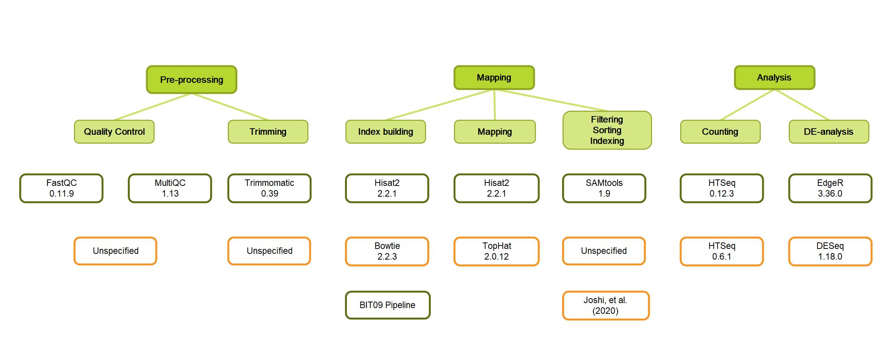

# High-Throughput-Analysis of Spinacia oleracea Genome
```diff
- README.md Not up-to-data yet 
```
## Credits
This analysis was performed by Anne-Sophie Chys and Ruben Olbrechts as a part of a project of High Throughput analysis at the university of applied sciences Howest.

## Introduction
This repository contains the scripts and data used for analyzing the Spinacia oleracea genome. The Sp75 Genome data was obtained from the SpinachBase and the analysis was performed using the latest version of the bioinformatics software tools.

## Prerequisites
The following tools were used for this analysis:

* HISAT2 for genome alignment
* FeatureCounts for gene expression quantification
* MultiQC for quality control and report generation

## Data processing and analysis
After downloading the raw data, the first order of business is to check the quality of the reads. To this end, FastQC (v0.11.9) and in extension MultiQC (v1.13) was used. Following the results of the quality control, the reads were trimmed to remove adaptors and low quality sequences using Trimmomatic (v0.39). A second quality control was using the same tools was performed to analyse the effectiveness of the trimming. This concludes the pre-processing of the data. The building of the index and mapping of the data is performed with Hisat2 (v2.2.1). After mapping, the reads are filtered on their mapping quality, sorted and indexed with SAMtools (v1.9). Then, the data is fed to HTSeq (v0.12.3) to count the transcript abundances in count per million (CPM). Finally, the DE-analysis is performed with the edgeR (v3.36.0) workflow. A comparison between this pipeline and the one used by Joshi, et al. (2020) is shown in the figure below.



## Scripts
The `scripts`directory contains the following scripts used for the analysis:

differential_expression_trimmed.sh:
differential_expression_untrimmed.sh:

## Results

## Usage
To reproduce the analysis, clone this repository and run the scripts in the following order:

1. `hisat2_alignment`: Align the reads to the SP75 genome.
2. `featurecounts_quantification`: Quantify the expression levels of the genes.
3. `multiqc_report`: Generate a report of the analysis results.

## References
* Study by Joshi, et al. (2020): https://www.ncbi.nlm.nih.gov/pmc/articles/PMC7202632/  
* SpinachBase: https://spinachbase.org/  
* HISAT2: https://ccb.jhu.edu/software/hisat2/index.shtml  
* FeatureCounts: http://subread.sourceforge.net/  
* MultiQC: https://multiqc.info/
